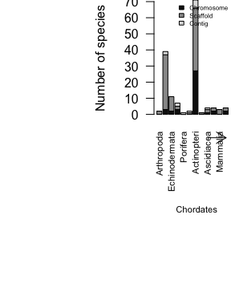

Identify coral reef genome assemblies
================

  - [Set up and load data](#set-up-and-load-data)
  - [Prepare data table](#prepare-data-table)
      - [Find reef-associated taxa from Fishbase and
        Sealifebase](#find-reef-associated-taxa-from-fishbase-and-sealifebase)
      - [Mark reef species in NCBI](#mark-reef-species-in-ncbi)
      - [Check for taxa of interest](#check-for-taxa-of-interest)
      - [Identify a preferred genome for each
        species](#identify-a-preferred-genome-for-each-species)
      - [Output list of reef genomes](#output-list-of-reef-genomes)
  - [Make plots](#make-plots)
      - [Read in list of genomes](#read-in-list-of-genomes)
      - [Plot of genomes available](#plot-of-genomes-available)

## Set up and load data

``` r
library(data.table)
library(rfishbase)
print(paste('Using newest of Fishbase available releases:', paste(available_releases(server = 'fishbase'), collapse = ', ')))
```

    ## [1] "Using newest of Fishbase available releases: 23.01, 21.06, 19.04"

``` r
print(paste('Using newest of Sealifebase available releases:', paste(available_releases(server = 'sealifebase'), collapse = ', ')))
```

    ## [1] "Using newest of Sealifebase available releases: 19.04, 21.11"

``` r
library(here)
```

    ## here() starts at /Users/mpinsky/Documents/Rutgers/ARG coral reef review/arg_coral_reefs

``` r
ncbi <- fread(here('data', 'ncbi', 'eukaryotes.csv')) # throws a warning about improper quoting, but appears to load correctly anyway
```

    ## Warning in fread(here("data", "ncbi", "eukaryotes.csv")): Found and
    ## resolved improper quoting out-of-sample. First healed line 4436:
    ## <<"Penstemon barbatus","Eukaryota;Plants;Land Plants","\"Duke\"
    ## line","SAMN09598766","PRJNA479669","GCA_003313485.1","Contig",
    ## 696.306,0,,"QOIQ01",18827,0,"2018-07-11T00:00:00Z",,>>. If the fields are not
    ## quoted (e.g. field separator does not appear within any field), try quote="" to
    ## avoid this warning.

``` r
setnames(ncbi, old = c('#Organism Name', 'Organism Groups', 'Size(Mb)', 'GC%', 'Release Date', 'GenBank FTP'), new = c('OrganismName', 'OrganismGroups', 'SizeMb', 'GBpercent', 'ReleaseDate', 'GenBankFTP'))
ncbi[, Level := gsub(' ', '', Level)]
```

## Prepare data table

Skip this section if already done and tables/reefgenomes.csv is
up-to-date

### Find reef-associated taxa from Fishbase and Sealifebase

``` r
# get reef-associated taxa
slsppcodes <- data.table(fb_tbl('ecology', 'sealifebase'))[as.logical(CoralReefs)==TRUE, .(SpecCode, CoralReefs)] # reef species codes in sealifebase
fbsppcodes <- data.table(fb_tbl('ecology', 'fishbase'))[as.logical(CoralReefs)==TRUE, .(SpecCode, CoralReefs)] # and in fishbase

print(paste('Found', nrow(slsppcodes), 'spp from Sealifebase')) # 3888
print(paste('Found', nrow(fbsppcodes), 'spp from Fishbase')) # 2430

# get their species names
slspp <- data.table(fb_tbl('species', 'sealifebase'))[SpecCode %in% slsppcodes$SpecCode, .(SpecCode, Genus, Species, FBname, FamCode)]
fbspp <- data.table(fb_tbl('species', 'fishbase'))[SpecCode %in% fbsppcodes$SpecCode, .(SpecCode, Genus, Species, FBname, FamCode)]

# get their phylum/class/order/family
slfam <- data.table(fb_tbl('families', 'sealifebase'))
fbfam <- data.table(fb_tbl('families', 'fishbase'))
slspp <- merge(slspp, slfam[, .(FamCode, Family, Order, Class, Phylum)], all.x = TRUE, by = 'FamCode')
fbspp <- merge(fbspp, fbfam[, .(FamCode, Family, Order, Class)], all.x = TRUE, by = 'FamCode')
fbspp[, Phylum := 'Chordata']
```

### Mark reef species in NCBI

``` r
# Sealifebase
slmatches <- sapply(slspp[, paste(Genus, Species)], grep, ncbi$OrganismName) # grep for Genus species
slmatchnum <- sapply(slmatches, length) # number of matches for each species
print(paste('SL species with genomes:', length(slmatchnum[slmatchnum > 0]))) # number of sealifebase reef species with an NCBI match. 74

# Fishbase
fbmatches <- sapply(fbspp[, paste(Genus, Species)], grep, ncbi$OrganismName) # grep for Genus species
fbmatchnum <- sapply(fbmatches, length) # number of matches for each species
print(paste('FB species with genomes:', length(fbmatchnum[fbmatchnum > 0]))) # fishbase reef species with an NCBI match. finds 75.

# mark genomes that are reef species
ncbi[, ":="(CoralReef = FALSE, Family = NA_character_, Order = NA_character_, Class = NA_character_, Phylum = NA_character_)]
for(i in 1:length(slmatches)){ # for each sealifebase species
    if(length(slmatches[[i]])>0){
        j <- slspp[, which(paste(Genus, Species) == names(slmatches)[i])]
        if(length(j) != 1) stop(paste('i=', i, 'and found more than one row in slspp with this Genus Species'))
        ncbi[slmatches[[i]], ":="(CoralReef = TRUE, Family = slspp$Family[j], Order = slspp$Order[j], Class = slspp$Class[j], Phylum = slspp$Phylum[j])] # adds metadata to all matching genomes. note that some spp have multiple genomes on NCBI    
    }
}
for(i in 1:length(fbmatches)){ # for each fishbase species
    if(length(fbmatches[[i]])>0){
        j <- fbspp[, which(paste(Genus, Species) == names(fbmatches)[i])]
        if(length(j) != 1) stop(paste('i=', i, 'and found more than one row in fbspp with this Genus Species'))
        ncbi[fbmatches[[i]], ":="(CoralReef = TRUE, Family = fbspp$Family[j], Order = fbspp$Order[j], Class = fbspp$Class[j], Phylum = fbspp$Phylum[j])] # adds metadata to all matching genomes. note that some spp have multiple genomes on NCBI    
    }
}
print(paste('Genomes from reef species:', ncbi[CoralReef == TRUE, .N]))
```

### Check for taxa of interest

There’s a noticeable lack of Symbiodiniaceae.

``` r
# Symbionts in sealifebase?
slspp[grep('Symbio', slspp$Family), ] # not classified as Symbiodiniaceae
slspp[grep('Symbio', slspp$Genus), ] # 1 Symbiodinium
slspp[grep('Suess', slspp$Order), ] # not classified as Suessiales
slspp[grep('Dinophyceae', slspp$Class), ] # 1 Dinophyceae
slspp[grep('Symbio', slspp$Genus), ]

# Symbionts in NCBI?
grep('Breviolum|Cladocopium|Durusdinium|Freudenthalidium|Halluxium|Miliolidium|Symbiodinium', ncbi$OrganismName, value = TRUE) # look for genera: found 14
```

### Identify a preferred genome for each species

Some species have multiple genomes. Choose chromosome \> scaffold \>
contig, then choose the newest release date, then the largest.

``` r
ncbi_reef <- ncbi[CoralReef == TRUE, ] # trim to just coral reef genomes
ncbi_reef[, selectedGenome := FALSE]
sppnames <- ncbi_reef[, unique(OrganismName)]
for(i in 1:length(sppnames)){
    j <- ncbi_reef[, which(OrganismName == sppnames[i])]
    if(length(j)==0) stop(paste('i=', i, 'but could not find it in ncbi_reef data.table'))
    if(length(j)==1) ncbi_reef[j, selectedGenome := TRUE] # if only one species, mark it
    if(length(j)>1){
        j <- ncbi_reef[, which(Level == 'Chromosome' & OrganismName == sppnames[i])]
        if(length(j)>0){
            if(length(j)==1) ncbi_reef[j, selectedGenome := TRUE] # if only one chromosome-scale assembly, mark it
            if(length(j)>1){
                maxDate <- ncbi_reef[j, max(as.Date(ReleaseDate))]
                j <- ncbi_reef[, which(Level == 'Chromosome' & OrganismName == sppnames[i] & as.Date(ReleaseDate) == maxDate)] # find the newest chromosome-scale assembly
                if(length(j)==1) ncbi_reef[j, selectedGenome := TRUE] # mark it
                if(length(j)>1){
                    maxSize <- ncbi_reef[j, max(SizeMb)]
                    j <- ncbi_reef[, which(Level == 'Chromosome' & OrganismName == sppnames[i] & as.Date(ReleaseDate) == maxDate & SizeMb == maxSize)] # find the largest chromosome-scale assembly
                    if(length(j)==1) ncbi_reef[j, selectedGenome := TRUE] # mark it
                    if(length(j)>1) stop(paste('i=', i, ', need to handle the case when multiple chromosome-scale assemblies have the same release date and size'))
                } 
            }
        }
        if(length(j) == 0){
            j <- ncbi_reef[, which(Level == 'Scaffold' & OrganismName == sppnames[i])]
            if(length(j)>0){
                if(length(j)==1) ncbi_reef[j, selectedGenome := TRUE] # if only one scaffold-scale assembly, mark it
                if(length(j)>1){
                    maxDate <- ncbi_reef[j, max(as.Date(ReleaseDate))]
                    j <- ncbi_reef[, which(Level == 'Scaffold' & OrganismName == sppnames[i] & as.Date(ReleaseDate) == maxDate)] # find the newest scaffold-scale assembly
                    if(length(j)==1) ncbi_reef[j, selectedGenome := TRUE] # mark it
                    if(length(j)>1){
                        maxSize <- ncbi_reef[j, max(SizeMb)]
                        j <- ncbi_reef[, which(Level == 'Scaffold' & OrganismName == sppnames[i] & as.Date(ReleaseDate) == maxDate & SizeMb == maxSize)] # find the largest scaffolds-scale assembly
                        if(length(j)==1) ncbi_reef[j, selectedGenome := TRUE] # mark it
                        if(length(j)>1) stop(paste('i=', i, ', need to handle the case when multiple scaffold-scale assemblies have the same release date and size'))
                    }
                }
            }
            if(length(j) == 0){
                j <- ncbi_reef[, which(Level == 'Contig' & OrganismName == sppnames[i])]
                if(length(j)>0){
                    if(length(j)==1) ncbi_reef[j, selectedGenome := TRUE] # if only one contig-scale assembly, mark it
                    if(length(j)>1){
                        maxDate <- ncbi_reef[j, max(as.Date(ReleaseDate))]
                        j <- ncbi_reef[, which(Level == 'Contig' & OrganismName == sppnames[i] & as.Date(ReleaseDate) == maxDate)] # find the newest contig-scale assembly
                        if(length(j)==1) ncbi_reef[j, selectedGenome := TRUE] # mark it
                        if(length(j)>1){
                            maxSize <- ncbi_reef[j, max(SizeMb)]
                            j <- ncbi_reef[, which(Level == 'Contig' & OrganismName == sppnames[i] & as.Date(ReleaseDate) == maxDate & SizeMb == maxSize)] # find the largest chromosome-scale assembly
                            if(length(j)==1) ncbi_reef[j, selectedGenome := TRUE] # mark it
                            if(length(j)>1) stop(paste('i=', i, ', need to handle the case when multiple contig-scale assemblies have the same release date and size'))
                        }
                    }
                } else {
                    stop(paste('i=', i, ', but could not find even a contig-scale assembly'))
                }
            }
        }
    }
}

# check
print(paste('Number of reef species genomes:', ncbi_reef[, .N]))
print(paste('Number of selected genomes:', ncbi_reef[selectedGenome==TRUE, .N]))
print(paste('Min number of selected genomes per species (should be 1):', ncbi_reef[, .(num = sum(selectedGenome)), by = OrganismName][, min(num)]))
print(paste('Max number of selected genomes per species (should be 1):', ncbi_reef[, .(num = sum(selectedGenome)), by = OrganismName][, max(num)]))
```

### Output list of reef genomes

Some slight column renaming so easier to read into R in the future.

``` r
write.csv(ncbi_reef[, .(OrganismName, Phylum, Class, Order, Family, OrganismGroups, Strain, BioSample, BioProject, Assembly, Level, SizeMb, GBpercent, WGS, Scaffolds, CDS, ReleaseDate, GenBankFTP, selectedGenome)], file = here('tables', 'reefgenomes.csv'), row.names = FALSE)
```

## Make plots

### Read in list of genomes

``` r
ncbi_reef <- as.data.table(read.csv(here('tables', 'reefgenomes.csv')))
```

### Plot of genomes available

``` r
# make a list of the taxonomic groups we want to show
taxonnames <- ncbi_reef[selectedGenome == TRUE, .(Order, Class, Phylum)]
taxonnames[, show := Phylum] # generally show Phylum
taxonnames[Phylum == 'Chordata', show := Class] # for fishes, show class
levs <- taxonnames[, unique(show)]
levsclass <- taxonnames[Phylum == 'Chordata', unique(Class)]
levs <- levs[order(levs)] # make alphabetical
i = which(levs %in% levsclass)
levs = c(levs[-i], levs[i]) # move chordates to end of list
taxonnames[, show := factor(show, levels = levs)]

# display
genome_table = table(ncbi_reef[selectedGenome == TRUE, factor(Level, levels = c('Chromosome', 'Scaffold', 'Contig'))], taxonnames[, show]) # also re-order the factor levels
cols = c('#111111', '#999999', '#DDDDDD')
par(mai = c(2.5, 2, 0, 0))
barplot(genome_table, beside = FALSE, cex.names = 0.7, las = 2, ylab = 'Number of species', col = cols)
legend('topright', legend = rownames(genome_table), cex = 0.5, fill = cols, bty = 'n')
mtext('Chordates', side = 1, line = 5.5, adj = 0.62, cex = 0.7)
arrows(10.5, -14.5, 14, -14.5, code = 2, xpd = TRUE, length = 0.15)
```

<!-- -->

``` r
# output to png
png(filename = here('figures', 'fig5.png'), width=3, height = 4, units = 'in', res = 300)
par(mai = c(1, 0.5, 0.1, 0), tcl = -0.1, mgp = c(1.5,0.4, 0))
barplot(genome_table, beside = FALSE, cex.names = 0.5, cex.axis = 0.5, cex.lab = 0.5, las = 2, ylab = 'Number of species', col = cols)
legend('topright', legend = rownames(genome_table), cex = 0.5, bty = 'n', fill = cols)
mtext('Chordates', side = 1, line = 3.3, adj = 0.65, cex = 0.6)
arrows(11, -20, 14, -20, code = 2, xpd = TRUE, length = 0.10)
dev.off()
```

    ## quartz_off_screen 
    ##                 2

``` r
# output to pdf
pdf(file = here('figures', 'fig5.pdf'), width=3, height = 4)
par(mai = c(1, 0.5, 0.1, 0), tcl = -0.1, mgp = c(1.5,0.4, 0))
barplot(genome_table, beside = FALSE, cex.names = 0.5, cex.axis = 0.5, cex.lab = 0.5, las = 2, ylab = 'Number of species', col = cols)
legend('topright', legend = rownames(genome_table), cex = 0.5, bty = 'n', fill = cols)
mtext('Chordates', side = 1, line = 3.3, adj = 0.65, cex = 0.6)
arrows(11, -20, 14, -20, code = 2, xpd = TRUE, length = 0.10)
dev.off()
```

    ## quartz_off_screen 
    ##                 2
