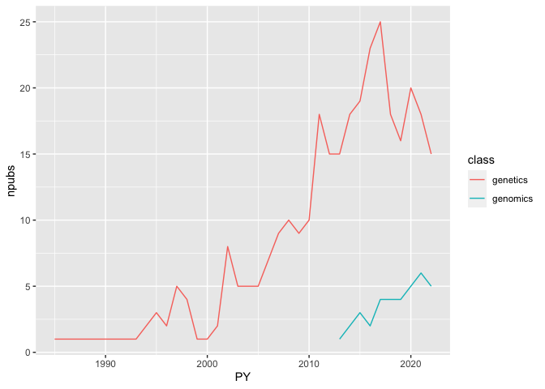
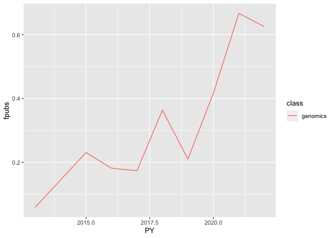
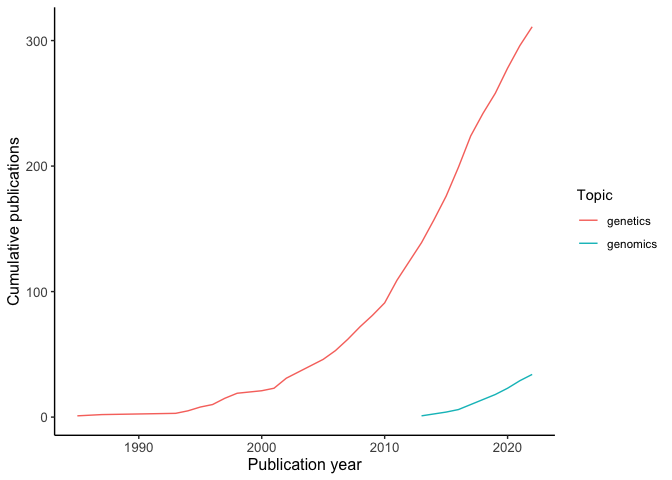

Plot coral reef pop gen study frequencies
================

  - [Setup](#setup)
  - [Plot publication number](#plot-publication-number)
  - [Plot publication fraction](#plot-publication-fraction)
  - [Plot cumulative sum](#plot-cumulative-sum)

# Setup

``` r
library(data.table)
library(ggplot2)
library(here)
```

    ## here() starts at /Users/mpinsky/Documents/Rutgers/ARG coral reef review/arg_coral_reefs

``` r
# Web of Science citations
wosgenetics <- fread(here('data', 'web_of_science', 'WoS_2022-10-18_population_genetics_coral.txt'), quote = "") # "population genetics" & "coral" in Topic
wosgenomics <- fread(here('data', 'web_of_science', 'WoS_2022-10-18_population_genomics_coral.txt'), quote = "") # population genomics & coral in Topic
for(i in 1:25){
    if(i ==1) wosall <- fread(here('data', 'web_of_science', 'WoS_2022-10-18_population_genomics_1.txt'), quote = "") # "population genomics" in Topic, tranch 1
    if(i>1){
        temp <-fread(here('data', 'web_of_science', paste0('WoS_2020-10-18_population_genomics_', i, '.txt')), quote = "") # pop genomics in Topic, tranch i 
        wosall <- rbind(wosall, temp)
    }
}
```

    ## Taking input= as a system command ('/Users/mpinsky/Documents/Rutgers/ARG coral reef review/arg_coral_reefs/data/web_of_science/WoS_2020-10-18_population_genomics_2.txt') and a variable has been used in the expression passed to `input=`. Please use fread(cmd=...). There is a security concern if you are creating an app, and the app could have a malicious user, and the app is not running in a secure environment; e.g. the app is running as root. Please read item 5 in the NEWS file for v1.11.6 for more information and for the option to suppress this message.

    ## Warning in (if (.Platform$OS.type == "unix") system else shell)(paste0("(", :
    ## error in running command

    ## Warning in fread(here("data", "web_of_science",
    ## paste0("WoS_2020-10-18_population_genomics_", : File '/var/folders/gf/
    ## nmkn64_100q2psgkx_wjrfpw0000gq/T//Rtmp8QcXx5/fileea6546d22729' has size 0.
    ## Returning a NULL data.table.

    ## Taking input= as a system command ('/Users/mpinsky/Documents/Rutgers/ARG coral reef review/arg_coral_reefs/data/web_of_science/WoS_2020-10-18_population_genomics_3.txt') and a variable has been used in the expression passed to `input=`. Please use fread(cmd=...). There is a security concern if you are creating an app, and the app could have a malicious user, and the app is not running in a secure environment; e.g. the app is running as root. Please read item 5 in the NEWS file for v1.11.6 for more information and for the option to suppress this message.

    ## Warning in (if (.Platform$OS.type == "unix") system else shell)(paste0("(", :
    ## error in running command

    ## Warning in fread(here("data", "web_of_science",
    ## paste0("WoS_2020-10-18_population_genomics_", : File '/var/folders/gf/
    ## nmkn64_100q2psgkx_wjrfpw0000gq/T//Rtmp8QcXx5/fileea65f091912' has size 0.
    ## Returning a NULL data.table.

    ## Taking input= as a system command ('/Users/mpinsky/Documents/Rutgers/ARG coral reef review/arg_coral_reefs/data/web_of_science/WoS_2020-10-18_population_genomics_4.txt') and a variable has been used in the expression passed to `input=`. Please use fread(cmd=...). There is a security concern if you are creating an app, and the app could have a malicious user, and the app is not running in a secure environment; e.g. the app is running as root. Please read item 5 in the NEWS file for v1.11.6 for more information and for the option to suppress this message.

    ## Warning in (if (.Platform$OS.type == "unix") system else shell)(paste0("(", :
    ## error in running command

    ## Warning in fread(here("data", "web_of_science",
    ## paste0("WoS_2020-10-18_population_genomics_", : File '/var/folders/gf/
    ## nmkn64_100q2psgkx_wjrfpw0000gq/T//Rtmp8QcXx5/fileea651e4cf474' has size 0.
    ## Returning a NULL data.table.

    ## Taking input= as a system command ('/Users/mpinsky/Documents/Rutgers/ARG coral reef review/arg_coral_reefs/data/web_of_science/WoS_2020-10-18_population_genomics_5.txt') and a variable has been used in the expression passed to `input=`. Please use fread(cmd=...). There is a security concern if you are creating an app, and the app could have a malicious user, and the app is not running in a secure environment; e.g. the app is running as root. Please read item 5 in the NEWS file for v1.11.6 for more information and for the option to suppress this message.

    ## Warning in (if (.Platform$OS.type == "unix") system else shell)(paste0("(", :
    ## error in running command

    ## Warning in fread(here("data", "web_of_science",
    ## paste0("WoS_2020-10-18_population_genomics_", : File '/var/folders/gf/
    ## nmkn64_100q2psgkx_wjrfpw0000gq/T//Rtmp8QcXx5/fileea654e44fb36' has size 0.
    ## Returning a NULL data.table.

    ## Taking input= as a system command ('/Users/mpinsky/Documents/Rutgers/ARG coral reef review/arg_coral_reefs/data/web_of_science/WoS_2020-10-18_population_genomics_6.txt') and a variable has been used in the expression passed to `input=`. Please use fread(cmd=...). There is a security concern if you are creating an app, and the app could have a malicious user, and the app is not running in a secure environment; e.g. the app is running as root. Please read item 5 in the NEWS file for v1.11.6 for more information and for the option to suppress this message.

    ## Warning in (if (.Platform$OS.type == "unix") system else shell)(paste0("(", :
    ## error in running command

    ## Warning in fread(here("data", "web_of_science",
    ## paste0("WoS_2020-10-18_population_genomics_", : File '/var/folders/gf/
    ## nmkn64_100q2psgkx_wjrfpw0000gq/T//Rtmp8QcXx5/fileea6512c8be5f' has size 0.
    ## Returning a NULL data.table.

    ## Taking input= as a system command ('/Users/mpinsky/Documents/Rutgers/ARG coral reef review/arg_coral_reefs/data/web_of_science/WoS_2020-10-18_population_genomics_7.txt') and a variable has been used in the expression passed to `input=`. Please use fread(cmd=...). There is a security concern if you are creating an app, and the app could have a malicious user, and the app is not running in a secure environment; e.g. the app is running as root. Please read item 5 in the NEWS file for v1.11.6 for more information and for the option to suppress this message.

    ## Warning in (if (.Platform$OS.type == "unix") system else shell)(paste0("(", :
    ## error in running command

    ## Warning in fread(here("data", "web_of_science",
    ## paste0("WoS_2020-10-18_population_genomics_", : File '/var/folders/gf/
    ## nmkn64_100q2psgkx_wjrfpw0000gq/T//Rtmp8QcXx5/fileea65394a589b' has size 0.
    ## Returning a NULL data.table.

    ## Taking input= as a system command ('/Users/mpinsky/Documents/Rutgers/ARG coral reef review/arg_coral_reefs/data/web_of_science/WoS_2020-10-18_population_genomics_8.txt') and a variable has been used in the expression passed to `input=`. Please use fread(cmd=...). There is a security concern if you are creating an app, and the app could have a malicious user, and the app is not running in a secure environment; e.g. the app is running as root. Please read item 5 in the NEWS file for v1.11.6 for more information and for the option to suppress this message.

    ## Warning in (if (.Platform$OS.type == "unix") system else shell)(paste0("(", :
    ## error in running command

    ## Warning in fread(here("data", "web_of_science",
    ## paste0("WoS_2020-10-18_population_genomics_", : File '/var/folders/gf/
    ## nmkn64_100q2psgkx_wjrfpw0000gq/T//Rtmp8QcXx5/fileea653fff457f' has size 0.
    ## Returning a NULL data.table.

    ## Taking input= as a system command ('/Users/mpinsky/Documents/Rutgers/ARG coral reef review/arg_coral_reefs/data/web_of_science/WoS_2020-10-18_population_genomics_9.txt') and a variable has been used in the expression passed to `input=`. Please use fread(cmd=...). There is a security concern if you are creating an app, and the app could have a malicious user, and the app is not running in a secure environment; e.g. the app is running as root. Please read item 5 in the NEWS file for v1.11.6 for more information and for the option to suppress this message.

    ## Warning in (if (.Platform$OS.type == "unix") system else shell)(paste0("(", :
    ## error in running command

    ## Warning in fread(here("data", "web_of_science",
    ## paste0("WoS_2020-10-18_population_genomics_", : File '/var/folders/gf/
    ## nmkn64_100q2psgkx_wjrfpw0000gq/T//Rtmp8QcXx5/fileea65102bb5ac' has size 0.
    ## Returning a NULL data.table.

    ## Taking input= as a system command ('/Users/mpinsky/Documents/Rutgers/ARG coral reef review/arg_coral_reefs/data/web_of_science/WoS_2020-10-18_population_genomics_10.txt') and a variable has been used in the expression passed to `input=`. Please use fread(cmd=...). There is a security concern if you are creating an app, and the app could have a malicious user, and the app is not running in a secure environment; e.g. the app is running as root. Please read item 5 in the NEWS file for v1.11.6 for more information and for the option to suppress this message.

    ## Warning in (if (.Platform$OS.type == "unix") system else shell)(paste0("(", :
    ## error in running command

    ## Warning in fread(here("data", "web_of_science",
    ## paste0("WoS_2020-10-18_population_genomics_", : File '/var/folders/gf/
    ## nmkn64_100q2psgkx_wjrfpw0000gq/T//Rtmp8QcXx5/fileea6525a4377f' has size 0.
    ## Returning a NULL data.table.

    ## Taking input= as a system command ('/Users/mpinsky/Documents/Rutgers/ARG coral reef review/arg_coral_reefs/data/web_of_science/WoS_2020-10-18_population_genomics_11.txt') and a variable has been used in the expression passed to `input=`. Please use fread(cmd=...). There is a security concern if you are creating an app, and the app could have a malicious user, and the app is not running in a secure environment; e.g. the app is running as root. Please read item 5 in the NEWS file for v1.11.6 for more information and for the option to suppress this message.

    ## Warning in (if (.Platform$OS.type == "unix") system else shell)(paste0("(", :
    ## error in running command

    ## Warning in fread(here("data", "web_of_science",
    ## paste0("WoS_2020-10-18_population_genomics_", : File '/var/folders/gf/
    ## nmkn64_100q2psgkx_wjrfpw0000gq/T//Rtmp8QcXx5/fileea6540378627' has size 0.
    ## Returning a NULL data.table.

    ## Taking input= as a system command ('/Users/mpinsky/Documents/Rutgers/ARG coral reef review/arg_coral_reefs/data/web_of_science/WoS_2020-10-18_population_genomics_12.txt') and a variable has been used in the expression passed to `input=`. Please use fread(cmd=...). There is a security concern if you are creating an app, and the app could have a malicious user, and the app is not running in a secure environment; e.g. the app is running as root. Please read item 5 in the NEWS file for v1.11.6 for more information and for the option to suppress this message.

    ## Warning in (if (.Platform$OS.type == "unix") system else shell)(paste0("(", :
    ## error in running command

    ## Warning in fread(here("data", "web_of_science",
    ## paste0("WoS_2020-10-18_population_genomics_", : File '/var/folders/gf/
    ## nmkn64_100q2psgkx_wjrfpw0000gq/T//Rtmp8QcXx5/fileea657d488b60' has size 0.
    ## Returning a NULL data.table.

    ## Taking input= as a system command ('/Users/mpinsky/Documents/Rutgers/ARG coral reef review/arg_coral_reefs/data/web_of_science/WoS_2020-10-18_population_genomics_13.txt') and a variable has been used in the expression passed to `input=`. Please use fread(cmd=...). There is a security concern if you are creating an app, and the app could have a malicious user, and the app is not running in a secure environment; e.g. the app is running as root. Please read item 5 in the NEWS file for v1.11.6 for more information and for the option to suppress this message.

    ## Warning in (if (.Platform$OS.type == "unix") system else shell)(paste0("(", :
    ## error in running command

    ## Warning in fread(here("data", "web_of_science",
    ## paste0("WoS_2020-10-18_population_genomics_", : File '/var/folders/gf/
    ## nmkn64_100q2psgkx_wjrfpw0000gq/T//Rtmp8QcXx5/fileea6525b68be2' has size 0.
    ## Returning a NULL data.table.

    ## Taking input= as a system command ('/Users/mpinsky/Documents/Rutgers/ARG coral reef review/arg_coral_reefs/data/web_of_science/WoS_2020-10-18_population_genomics_14.txt') and a variable has been used in the expression passed to `input=`. Please use fread(cmd=...). There is a security concern if you are creating an app, and the app could have a malicious user, and the app is not running in a secure environment; e.g. the app is running as root. Please read item 5 in the NEWS file for v1.11.6 for more information and for the option to suppress this message.

    ## Warning in (if (.Platform$OS.type == "unix") system else shell)(paste0("(", :
    ## error in running command

    ## Warning in fread(here("data", "web_of_science",
    ## paste0("WoS_2020-10-18_population_genomics_", : File '/var/folders/gf/
    ## nmkn64_100q2psgkx_wjrfpw0000gq/T//Rtmp8QcXx5/fileea657399b5c5' has size 0.
    ## Returning a NULL data.table.

    ## Taking input= as a system command ('/Users/mpinsky/Documents/Rutgers/ARG coral reef review/arg_coral_reefs/data/web_of_science/WoS_2020-10-18_population_genomics_15.txt') and a variable has been used in the expression passed to `input=`. Please use fread(cmd=...). There is a security concern if you are creating an app, and the app could have a malicious user, and the app is not running in a secure environment; e.g. the app is running as root. Please read item 5 in the NEWS file for v1.11.6 for more information and for the option to suppress this message.

    ## Warning in (if (.Platform$OS.type == "unix") system else shell)(paste0("(", :
    ## error in running command

    ## Warning in fread(here("data", "web_of_science",
    ## paste0("WoS_2020-10-18_population_genomics_", : File '/var/folders/gf/
    ## nmkn64_100q2psgkx_wjrfpw0000gq/T//Rtmp8QcXx5/fileea65706cd3cd' has size 0.
    ## Returning a NULL data.table.

    ## Taking input= as a system command ('/Users/mpinsky/Documents/Rutgers/ARG coral reef review/arg_coral_reefs/data/web_of_science/WoS_2020-10-18_population_genomics_16.txt') and a variable has been used in the expression passed to `input=`. Please use fread(cmd=...). There is a security concern if you are creating an app, and the app could have a malicious user, and the app is not running in a secure environment; e.g. the app is running as root. Please read item 5 in the NEWS file for v1.11.6 for more information and for the option to suppress this message.

    ## Warning in (if (.Platform$OS.type == "unix") system else shell)(paste0("(", :
    ## error in running command

    ## Warning in fread(here("data", "web_of_science",
    ## paste0("WoS_2020-10-18_population_genomics_", : File '/var/folders/gf/
    ## nmkn64_100q2psgkx_wjrfpw0000gq/T//Rtmp8QcXx5/fileea6578c57164' has size 0.
    ## Returning a NULL data.table.

    ## Taking input= as a system command ('/Users/mpinsky/Documents/Rutgers/ARG coral reef review/arg_coral_reefs/data/web_of_science/WoS_2020-10-18_population_genomics_17.txt') and a variable has been used in the expression passed to `input=`. Please use fread(cmd=...). There is a security concern if you are creating an app, and the app could have a malicious user, and the app is not running in a secure environment; e.g. the app is running as root. Please read item 5 in the NEWS file for v1.11.6 for more information and for the option to suppress this message.

    ## Warning in (if (.Platform$OS.type == "unix") system else shell)(paste0("(", :
    ## error in running command

    ## Warning in fread(here("data", "web_of_science",
    ## paste0("WoS_2020-10-18_population_genomics_", : File '/var/folders/gf/
    ## nmkn64_100q2psgkx_wjrfpw0000gq/T//Rtmp8QcXx5/fileea656a979a2d' has size 0.
    ## Returning a NULL data.table.

    ## Taking input= as a system command ('/Users/mpinsky/Documents/Rutgers/ARG coral reef review/arg_coral_reefs/data/web_of_science/WoS_2020-10-18_population_genomics_18.txt') and a variable has been used in the expression passed to `input=`. Please use fread(cmd=...). There is a security concern if you are creating an app, and the app could have a malicious user, and the app is not running in a secure environment; e.g. the app is running as root. Please read item 5 in the NEWS file for v1.11.6 for more information and for the option to suppress this message.

    ## Warning in (if (.Platform$OS.type == "unix") system else shell)(paste0("(", :
    ## error in running command

    ## Warning in fread(here("data", "web_of_science",
    ## paste0("WoS_2020-10-18_population_genomics_", : File '/var/folders/gf/
    ## nmkn64_100q2psgkx_wjrfpw0000gq/T//Rtmp8QcXx5/fileea6570b3707' has size 0.
    ## Returning a NULL data.table.

    ## Taking input= as a system command ('/Users/mpinsky/Documents/Rutgers/ARG coral reef review/arg_coral_reefs/data/web_of_science/WoS_2020-10-18_population_genomics_19.txt') and a variable has been used in the expression passed to `input=`. Please use fread(cmd=...). There is a security concern if you are creating an app, and the app could have a malicious user, and the app is not running in a secure environment; e.g. the app is running as root. Please read item 5 in the NEWS file for v1.11.6 for more information and for the option to suppress this message.

    ## Warning in (if (.Platform$OS.type == "unix") system else shell)(paste0("(", :
    ## error in running command

    ## Warning in fread(here("data", "web_of_science",
    ## paste0("WoS_2020-10-18_population_genomics_", : File '/var/folders/gf/
    ## nmkn64_100q2psgkx_wjrfpw0000gq/T//Rtmp8QcXx5/fileea657149b02d' has size 0.
    ## Returning a NULL data.table.

    ## Taking input= as a system command ('/Users/mpinsky/Documents/Rutgers/ARG coral reef review/arg_coral_reefs/data/web_of_science/WoS_2020-10-18_population_genomics_20.txt') and a variable has been used in the expression passed to `input=`. Please use fread(cmd=...). There is a security concern if you are creating an app, and the app could have a malicious user, and the app is not running in a secure environment; e.g. the app is running as root. Please read item 5 in the NEWS file for v1.11.6 for more information and for the option to suppress this message.

    ## Warning in (if (.Platform$OS.type == "unix") system else shell)(paste0("(", :
    ## error in running command

    ## Warning in fread(here("data", "web_of_science",
    ## paste0("WoS_2020-10-18_population_genomics_", : File '/var/folders/gf/
    ## nmkn64_100q2psgkx_wjrfpw0000gq/T//Rtmp8QcXx5/fileea651ccd9476' has size 0.
    ## Returning a NULL data.table.

    ## Taking input= as a system command ('/Users/mpinsky/Documents/Rutgers/ARG coral reef review/arg_coral_reefs/data/web_of_science/WoS_2020-10-18_population_genomics_21.txt') and a variable has been used in the expression passed to `input=`. Please use fread(cmd=...). There is a security concern if you are creating an app, and the app could have a malicious user, and the app is not running in a secure environment; e.g. the app is running as root. Please read item 5 in the NEWS file for v1.11.6 for more information and for the option to suppress this message.

    ## Warning in (if (.Platform$OS.type == "unix") system else shell)(paste0("(", :
    ## error in running command

    ## Warning in fread(here("data", "web_of_science",
    ## paste0("WoS_2020-10-18_population_genomics_", : File '/var/folders/gf/
    ## nmkn64_100q2psgkx_wjrfpw0000gq/T//Rtmp8QcXx5/fileea657ccdddbf' has size 0.
    ## Returning a NULL data.table.

    ## Taking input= as a system command ('/Users/mpinsky/Documents/Rutgers/ARG coral reef review/arg_coral_reefs/data/web_of_science/WoS_2020-10-18_population_genomics_22.txt') and a variable has been used in the expression passed to `input=`. Please use fread(cmd=...). There is a security concern if you are creating an app, and the app could have a malicious user, and the app is not running in a secure environment; e.g. the app is running as root. Please read item 5 in the NEWS file for v1.11.6 for more information and for the option to suppress this message.

    ## Warning in (if (.Platform$OS.type == "unix") system else shell)(paste0("(", :
    ## error in running command

    ## Warning in fread(here("data", "web_of_science",
    ## paste0("WoS_2020-10-18_population_genomics_", : File '/var/folders/gf/
    ## nmkn64_100q2psgkx_wjrfpw0000gq/T//Rtmp8QcXx5/fileea652f99669c' has size 0.
    ## Returning a NULL data.table.

    ## Taking input= as a system command ('/Users/mpinsky/Documents/Rutgers/ARG coral reef review/arg_coral_reefs/data/web_of_science/WoS_2020-10-18_population_genomics_23.txt') and a variable has been used in the expression passed to `input=`. Please use fread(cmd=...). There is a security concern if you are creating an app, and the app could have a malicious user, and the app is not running in a secure environment; e.g. the app is running as root. Please read item 5 in the NEWS file for v1.11.6 for more information and for the option to suppress this message.

    ## Warning in (if (.Platform$OS.type == "unix") system else shell)(paste0("(", :
    ## error in running command

    ## Warning in fread(here("data", "web_of_science",
    ## paste0("WoS_2020-10-18_population_genomics_", : File '/var/folders/gf/
    ## nmkn64_100q2psgkx_wjrfpw0000gq/T//Rtmp8QcXx5/fileea651fa42e' has size 0.
    ## Returning a NULL data.table.

    ## Taking input= as a system command ('/Users/mpinsky/Documents/Rutgers/ARG coral reef review/arg_coral_reefs/data/web_of_science/WoS_2020-10-18_population_genomics_24.txt') and a variable has been used in the expression passed to `input=`. Please use fread(cmd=...). There is a security concern if you are creating an app, and the app could have a malicious user, and the app is not running in a secure environment; e.g. the app is running as root. Please read item 5 in the NEWS file for v1.11.6 for more information and for the option to suppress this message.

    ## Warning in (if (.Platform$OS.type == "unix") system else shell)(paste0("(", :
    ## error in running command

    ## Warning in fread(here("data", "web_of_science",
    ## paste0("WoS_2020-10-18_population_genomics_", : File '/var/folders/gf/
    ## nmkn64_100q2psgkx_wjrfpw0000gq/T//Rtmp8QcXx5/fileea651d53c812' has size 0.
    ## Returning a NULL data.table.

    ## Taking input= as a system command ('/Users/mpinsky/Documents/Rutgers/ARG coral reef review/arg_coral_reefs/data/web_of_science/WoS_2020-10-18_population_genomics_25.txt') and a variable has been used in the expression passed to `input=`. Please use fread(cmd=...). There is a security concern if you are creating an app, and the app could have a malicious user, and the app is not running in a secure environment; e.g. the app is running as root. Please read item 5 in the NEWS file for v1.11.6 for more information and for the option to suppress this message.

    ## Warning in (if (.Platform$OS.type == "unix") system else shell)(paste0("(", :
    ## error in running command

    ## Warning in fread(here("data", "web_of_science",
    ## paste0("WoS_2020-10-18_population_genomics_", : File '/var/folders/gf/
    ## nmkn64_100q2psgkx_wjrfpw0000gq/T//Rtmp8QcXx5/fileea65677424c8' has size 0.
    ## Returning a NULL data.table.

``` r
# transform
sumgenetics <- wosgenetics[, .(npubs = .N, class = 'genetics'), by = PY]
sumgenomics <- wosgenomics[, .(npubs = .N, class = 'genomics'), by = PY]
sumall <- wosall[, .(npubs = .N, class = 'all'), by = PY]
sum <- rbind(sumgenetics[!is.na(PY),], sumgenomics[!is.na(PY),])
sum <- merge(sum, sumall[, .(PY, npubsall = npubs)])
sum[, fpubs := npubs/npubsall]
sum[, cumpubs := cumsum(npubs), by = class]
```

# Plot publication number

``` r
ggplot(sum, aes(PY, npubs, color = class, group = class)) +
    geom_line()
```

<!-- -->

# Plot publication fraction

Y-axis is fraction of coral population genomics publications out of all
population genomics publications

``` r
ggplot(sum[class =='genomics'], aes(PY, fpubs, color = class, group = class)) +
    geom_line()
```

<!-- -->

# Plot cumulative sum

``` r
ggplot(sum, aes(PY, cumpubs, color = class)) +
    geom_line()+
    labs(x = 'Publication year', y = 'Cumulative publications', color = 'Topic') +
    theme(panel.grid.major = element_blank(), panel.grid.minor = element_blank(),
          panel.background = element_blank(), axis.line = element_line(colour = "black"),
          legend.key=element_blank(),
          axis.text=element_text(size=10),
          axis.title=element_text(size=12))
```

<!-- -->

``` r
ggsave('figures/fig1.png', width=5, height=2.5, units = 'in')
ggsave('figures/fig1.pdf', width=5, height=2.5, units = 'in')
```
